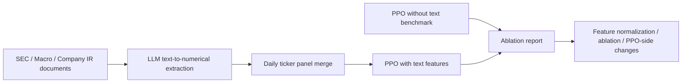
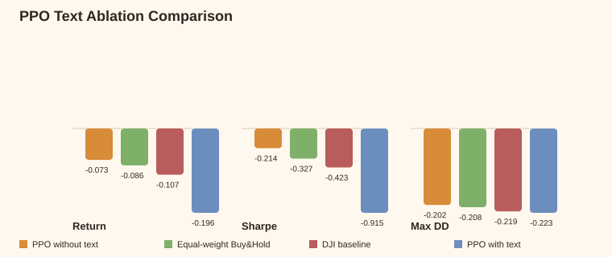

# FinGPT as Feature Generator

Small, portable experiment package for testing whether causal financial text
features improve a Dow 30 PPO trading agent.

## Snapshot

| Block | Current artifact |
|---|---|
| Documents | `20,005` timestamped text rows |
| PPO panel | `96,019` daily stock rows |
| Text extractor | `mistral-small-latest` |
| Text features | `10` numerical PPO features |
| Baseline | PPO without text, `350k` steps |
| First result | negative ablation; use it to debug features |
| Large files | tracked with Git LFS |

## Pipeline

## First Ablation

| Strategy | Return | Sharpe | Max DD |
|---|---:|---:|---:|
| PPO without text | `-7.29%` | `-0.214` | `-20.2%` |
| PPO with Mistral text | `-19.60%` | `-0.915` | `-22.28%` |

## Main Files

| Path | Purpose |
|---|---|
| `Guide.md` | full step-by-step run guide |
| `feature_schema.json` | first 10 text-to-numerical features |
| `data/train_2010_2021/` | train text documents |
| `data/test_2021_2023/` | test text documents |
| `artifacts/text_features_mistral.csv` | completed Mistral extraction |
| `artifacts/processed_final_fixed_external_lagclean_full_WITH_TEXT_MISTRAL.csv` | merged PPO panel |
| `ppo_without_text_BENCHMARK/` | frozen baseline model and metrics |
| `rl_stage0_project/` | copied local PPO Stage0 code |
| `train_ppo_with_text.ipynb` | notebook wrapper for training and comparison |

## Commands

| Step | Command |
|---|---|
| Extract | `python scripts/01_extract_text_features_mistral.py --input data/train_2010_2021 --input data/test_2021_2023 --output artifacts/text_features_mistral.csv` |
| Merge | `python scripts/02_merge_text_features_with_prices.py --base-panel data/processed_final_fixed_external_lagclean_full.csv --text-features artifacts/text_features_mistral.csv --output artifacts/processed_final_fixed_external_lagclean_full_WITH_TEXT_MISTRAL.csv` |
| Train | `python scripts/03_train_backtest_ppo_with_text.py --timesteps 350000` |
| Compare | `python scripts/04_compare_with_benchmark.py` |

## Team Lanes

| Branch | Owner lane | Focus |
|---|---|---|
| `LLM` | 蔡志成 | extraction quality, prompts, model/API comparison |
| `Features` | Tianyi Tan | feature selection, smoothing, macro vs company split |
| `DRL` | Vanya | PPO-side changes, source quality, evaluation loop |

## Next Experiments

| Experiment | Why |
|---|---|
| Train-only normalization | PPO is scale-sensitive |
| Feature-group ablations | find harmful vs useful feature families |
| Macro vs company features | different text sources should not be mixed blindly |
| 3d / 5d / 21d decay | filings and earnings releases matter beyond one day |
| Reward/risk text use | text may work better as risk control than raw state |
| Two-branch PPO policy | market features and text features need separate encoders |
