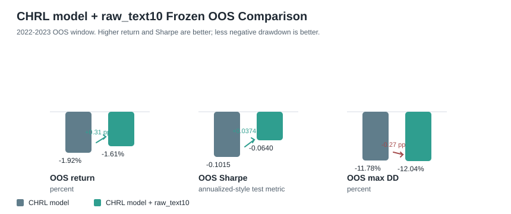
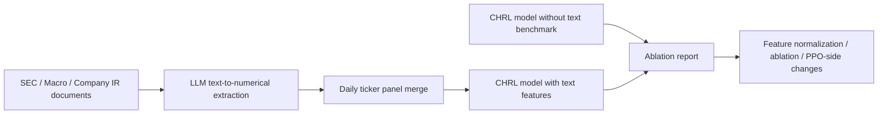

# FinGPT as Feature Generator

## Abstract

This project tests whether leakage-safe financial text features can improve a
portfolio reinforcement learning agent. The feature engine converts causal SEC,
macro, and company text evidence into fixed numerical features, merges them into
the RL panel, and evaluates them through controlled OOS ablations.

The current best result is modest but useful: on the frozen 2022-2023 OOS window,
`CHRL model + raw_text10` improves return from `-1.92%` to `-1.61%` and Sharpe
from `-0.1015` to `-0.0640` versus the `CHRL model` baseline. Max drawdown moves
from `-11.78%` to `-12.04%`, so the text signal helps return/risk-adjusted score
but still needs drawdown-aware filtering.

## Snapshot

| Block | Current artifact |
|---|---|
| Documents | `20,005` timestamped text rows |
| PPO panel | `96,019` daily stock rows |
| Text extractor | `mistral-small-latest` |
| Text features | `10` numerical PPO features |
| Baseline | `CHRL model` without text |
| Current result | `CHRL model + raw_text10` improves OOS return and Sharpe |
| Large files | tracked with Git LFS |

## Pipeline

## CHRL Frozen OOS

| setup | OOS return | OOS Sharpe | OOS max DD |
|---|---:|---:|---:|
| `CHRL model` | `-1.92%` | `-0.1015` | `-11.78%` |
| `CHRL model + raw_text10` | `-1.61%` | `-0.0640` | `-12.04%` |

The current best text candidate is `CHRL model + raw_text10`.
It improves frozen OOS return and Sharpe versus the CHRL baseline, while max
drawdown is slightly worse.

## Main Files

| Path | Purpose |
|---|---|
| `Guide.md` | full step-by-step run guide |
| `feature_schema.json` | first 10 text-to-numerical features |
| `data/train_2010_2021/` | train text documents |
| `data/test_2021_2023/` | test text documents |
| `artifacts/text_features_mistral.csv` | completed Mistral extraction |
| `artifacts/processed_final_fixed_external_lagclean_full_WITH_TEXT_MISTRAL.csv` | merged PPO panel |
| `ppo_without_text_BENCHMARK/` | frozen baseline model and metrics |
| `rl_stage0_project/` | copied local PPO Stage0 code |
| `train_ppo_with_text.ipynb` | notebook wrapper for training and comparison |
